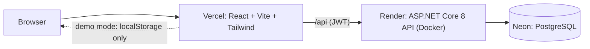

# Job Tracker

[](https://github.com/id-nynt/260001_JobTracker/actions/workflows/ci.yml)


A full-stack web app for tracking job applications from **Applied** to **Offer**, organised into job-search groups, with an overview of response, interview and offer rates.

**Live demo:** _add your Vercel URL here_ &nbsp;·&nbsp; click **Try the demo (no sign-up)** to explore with sample data.

<!-- Add a short GIF or screenshot here: add a job, change its status, watch the overview update. Save it as docs/demo.gif and embed with  -->

## Highlights

- **Real accounts with private data**: JWT login, BCrypt-hashed passwords, and every query scoped to the signed-in user. Another user's record answers `404`, as if it did not exist. Automated tests prove it.
- **Two modes, one UI**: real accounts talk to the API; the demo runs on sample data in the browser through a second implementation of the same interface that follows the same rules (default group, unique names, calculated counts and dates).
- **Production-minded backend**: ASP.NET Core 8, EF Core + PostgreSQL, validated input, uniform `ProblemDetails` errors, rate-limited auth, restricted CORS, health check, non-root Docker image. The app refuses to start without a real JWT secret.
- **Tested where it matters**: 32 backend and 20 frontend tests, every one checked by deliberately breaking the code to see it fail. CI runs them on every push.
- **Overview dashboard**: response, interview and offer rates and a weekly activity chart, computed by a small pure function with tests.

## Architecture



| Layer | Technology |
| --- | --- |
| Frontend | React 18, Vite, React Router, Tailwind CSS, Axios, Vitest + Testing Library, ESLint |
| Backend | ASP.NET Core 8 Web API, EF Core 8, Npgsql, JWT bearer, BCrypt, Swagger, xUnit + FluentAssertions |
| Data | PostgreSQL (Neon in production, Docker locally) |
| Delivery | Docker, GitHub Actions CI, Vercel (frontend), Render (API) |

## Run it locally

Requirements: Node 20+, .NET 8 SDK, Docker (for PostgreSQL).

```bash
# 1. Database
docker run -d --name jobtracker-db -e POSTGRES_DB=jobtracker -e POSTGRES_USER=jobtracker \
  -e POSTGRES_PASSWORD=jobtracker -p 5432:5432 postgres:16      # or: docker compose up -d db

# 2. API  (http://localhost:5000/swagger)
cd 260001_be
dotnet user-secrets set "Jwt:Secret" "any-random-string-of-32-or-more-chars"
dotnet run                                                      # applies migrations on startup

# 3. Frontend  (http://localhost:3000)
cd ../260001_fe
npm install
npm run dev
```

No backend needed to look around: start only the frontend and use **Try the demo**.

```bash
dotnet test 260001_be.Tests        # backend: integration + domain tests (in-memory SQLite)
cd 260001_fe && npm test           # frontend tests
cd 260001_fe && npm run lint
```

## API

All endpoints except `auth/*` and `/health` require `Authorization: Bearer <token>`. Interactive docs: `/swagger`.

| Method | Path | Purpose |
| --- | --- | --- |
| POST | `/api/auth/register`, `/api/auth/login` | Create an account / sign in (returns a JWT) |
| GET, POST | `/api/jobs` | List / create applications |
| GET, PUT, DELETE | `/api/jobs/{id}` | Read / update / delete one application |
| GET, POST | `/api/periods` | List / create groups (with job count and date range) |
| GET, PUT, DELETE | `/api/periods/{id}` | Read / rename / delete a group (its jobs move to *Default*) |
| GET | `/health` | Liveness check |

## Project structure

```
260001_be/           ASP.NET Core API (Controllers, Models, DTOs, Services, Data, Migrations)
260001_be.Tests/     xUnit tests: Api/ (HTTP, in memory) and Domain/
260001_fe/           React app (src/api = real + demo implementations, src/components, src/utils)
docs/                Deployment guide, build-from-scratch guide, audit and fix plan
.github/workflows/   CI
```

## Design decisions and trade-offs

- **`404`, not `403`, for other users' data.** A `403` would confirm the record exists. Every query filters on the user id from the token, so there is no "forgot to check" path to leak data.
- **Demo mode is a second implementation, not a fallback.** An earlier version silently fell back to sample data whenever the API failed, which meant a wrong password still "logged you in". Now the mode is an explicit choice made at login, and API errors always reach the user.
- **Stats are computed in the browser.** One tested function serves both modes. With thousands of applications per user this would move to a server-side query.
- **Backend tests use in-memory SQLite, not PostgreSQL.** They run anywhere without Docker and exercise the real controllers, auth and validation; the trade-off is that provider-specific SQL differences are not covered.
- **Token in `localStorage`.** Simple and fine for a demo-scale app, but readable by injected scripts. The next step would be an `httpOnly` cookie with a refresh token.
- **Free hosting sleeps.** The first request after idle can take ~30 s; the login page wakes the API early and says so, and the demo avoids the problem entirely.

## More

- [Deployment guide](docs/DEPLOYMENT.md): Neon + Render + Vercel, step by step
- [Build it from scratch](docs/BUILD_FROM_SCRATCH_GUIDE.md): the process behind this project, written for beginners
- [Portfolio audit](docs/PORTFOLIO_AUDIT.md) and [fix plan](docs/FIX_PLAN.md): what was wrong, and how it was fixed

## Roadmap

Search and filter, CSV export, a status-history timeline, Playwright end-to-end tests, `httpOnly` cookie auth.

## License

[MIT](LICENSE)
